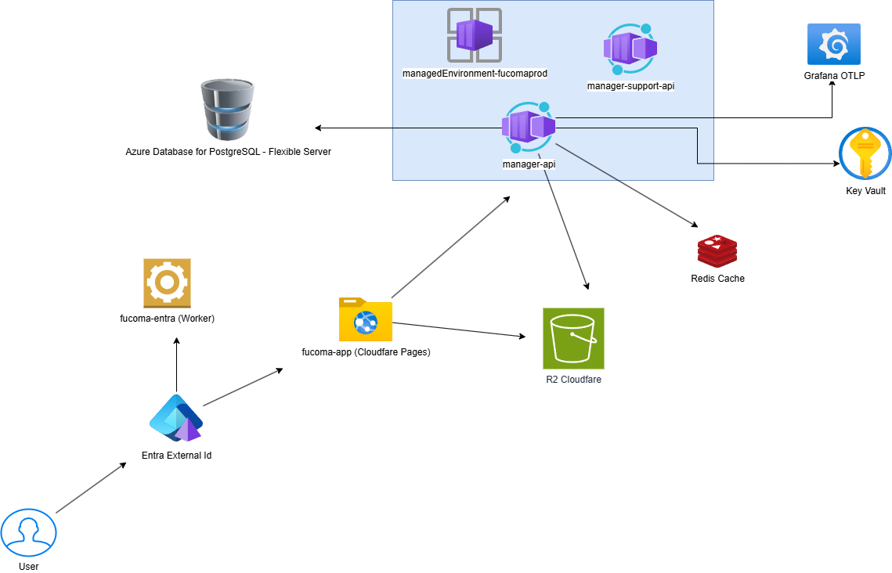
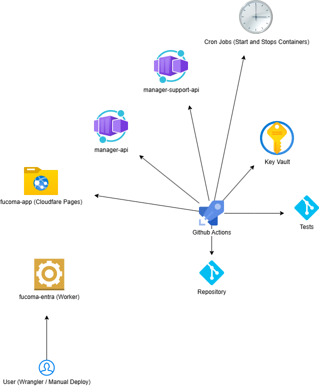

# FuCoMa Bookmark Manager


## Architecture 

- Using Azure and Cloudfare Services



## Deployment




## Build

Run `dotnet build` to build the solution.

## Run

To run the web application:

```bash
cd .\src\Manager\Manager.API
dotnet watch run
```
Navigate to https://localhost:5001. The application will automatically reload if you change any of the source files.


## Code Styles & Formatting

The template includes [EditorConfig](https://editorconfig.org/) support to help maintain consistent coding styles for multiple developers working on the same project across various editors and IDEs. The **.editorconfig** file defines the coding styles applicable to this solution.


## Test

The solution contains unit, integration tests.

To run the tests:
```bash
dotnet test
```


## Database

The template is configured to use PostgresSQL by default. 

When you run the application the database will be automatically created (if necessary) and the latest migrations will be applied.

Running database migrations is easy. Ensure you add the following flags to your command (values assume you are executing from repository root)

* `--project src/Infrastructure` (optional if in this folder)
* `--startup-project src/Web`
* `--output-dir Data/Migrations`

For example, to add a new migration from the root folder:


 ```bash
 dotnet ef migrations add "SampleMigration"  --project src\Manager\Manager.Infrastructure  --startup-project src\Manager\Manager.API --output-dir Data\Migrations
 ```

 ```bash 
 Add-Migration SampleMigration -OutputDir "Data/Migrations"
 ```

 For removing last migration use:

 If we want to remove a migration that has been committed, we must reverse the migration first "update to a previous migration"

* Note, we can use flag --force but it will not be sync or know about the state of the database


```bash
dotnet ef migrations remove --project src\Manager\Manager.Infrastructure --startup-project src\Manager\Manager.API
```

For remove migration

```bash
Remove-Migration 
 ```

If your migration is not the last migration. first, rollback to the migration you need 
by Update-Database then delete all migration classes after that migration.

```bash
Update-Database -Migration 001
```

```bash
dotnet ef database update 20240620223944_IdentityProviderChangeType --project src\Manager\Manager.Infrastructure --startup-project src\Manager\Manager.API  --connection "Server=127.0.0.1;Port=5432;Database=ManagerDB;User Id=xxxx;Password=xxxx"
```


```bash
Remove-Migration 002
```

In development environment the migrations will be applied automatically

```bash
if (app.Environment.IsDevelopment())
{
    await app.InitialiseDatabaseAsync();
}
```

But in other environments the "Update-Database" command is required


